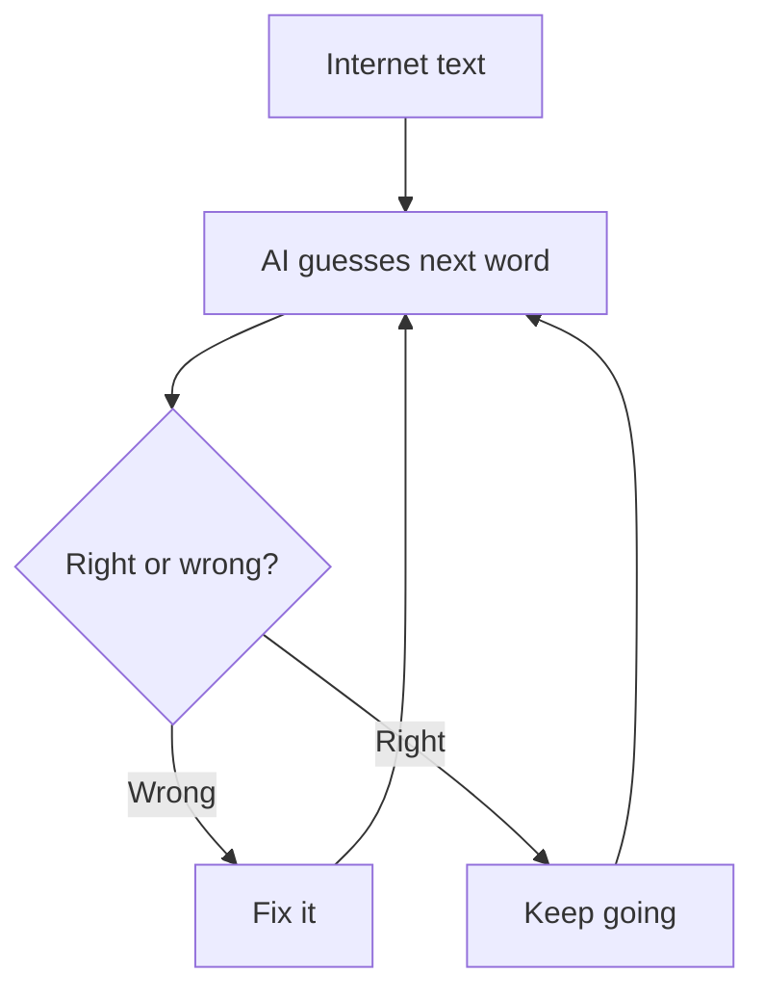

> **Note:** I used AI to help me organize and write this because I'm dyslexic. All the actual research, the comparisons, and the ideas about how different AIs work is mine. AI just helped me get my thoughts into clean writing so it's easier to read. I already know how these systems work and this doc explains the real differences. I'm a student working on this in my free time. I'm open to feedback or if anyone sees mistakes.

# How LLMs Work: GPT, Claude, DeepSeek vs. Neurosymbolic AI

Just a comparison of how different AI systems work and why mine is different.

---

## 1. What is an LLM?

GPT, Claude, and DeepSeek are all large language models (LLMs). They're basically really good at guessing the next word.

If you type "The sky is...", the AI has seen tons of text so it guesses "blue." But it's not actually thinking about the sky. It's just pattern matching. Like "I've seen this phrase a million times, next word is usually blue."

---

## 2. How They Work Inside

All these AI models use a system called a transformer. Here's the simple version:

- Break your words into chunks
- Look at how words relate to each other
- Do some math on those relationships
- Guess the next word

That's it. Repeat those steps and you get your answer.


The main trick is called attention. When the AI sees "The cat sat on..." it looks back and says "okay, cat is the main thing here." Then it uses that to guess the next word.

---

## 3. How They're Trained

The process is simple:

- Grab billions of words from the internet
- Feed in a sentence and have the AI guess the next word
- If it's wrong, adjust the AI to do better
- Repeat millions of times until it gets really good



Once training is done, that's it. The AI is frozen. It can't learn new stuff unless you retrain the whole thing, which takes forever and costs a lot.

---

## 4. How They Respond to You

When you ask a question:

- Break your words into chunks
- Look at previous conversation for context
- Guess the next word based on what it learned
- Use that word to guess the next one
- Keep going until it decides to stop


The AI can only remember a limited amount of previous text. Like the last 50 to 100 messages or so. After that, it forgets.

---

## 5. The Three Big Players

**GPT (by OpenAI)**
Really good at a lot of different things. Sometimes makes stuff up confidently (hallucinations). Trained on tons of internet text.

**Claude (by Anthropic)**
More careful with answers. More likely to say "I don't know" instead of guessing. Trained to avoid giving bad advice.

**DeepSeek**
Works in multiple languages. Tries to be fast and efficient. Newer player in the AI game.

**The truth:** They're all basically the same. They all predict the next word. The main differences are just what they were trained on and how they were adjusted after training.

---

## 6. Why They Mess Up

| Problem | Why | Example |
|---|---|---|
| Makes stuff up | Guesses words that sound right but aren't | "Elon Musk invented pizza in 1995" |
| Old knowledge | Training ended at a certain date | Can't talk about 2025 stuff if trained on 2023 data |
| Says different things | No system to check if it contradicts itself | Might say "I like dogs" then "I hate dogs" later |
| Bad at logic | It's pattern matching, not actual thinking | Hard multi step math problems fail |
| Forgets stuff | Can only remember last 50 to 100 messages or so | Long convos don't remember what you said at the start |
| Can't learn | Frozen after training | Even if you correct it, it won't remember next time |

---

## 7. Side by Side Comparison

| Thing | Normal AI (GPT/Claude) | My System |
|---|---|---|
| Memory | Hidden inside the AI | Stored as a list of facts you can see |
| Learning | Can't learn (frozen) | Learns during the conversation |
| Checking facts | Doesn't check, just guesses | Checks facts against each other |
| Reasoning | Pattern based guessing | Actual logic |
| When it breaks | Makes stuff up | Only as good as what it knows |
| Updating info | Can't do it | Updates automatically |
| Explain why | Can't really explain | Can show you the actual facts |
| Talking naturally | Really good | Pretty good |
| Speed | Fast | A little slower |

---

## 8. The Core Difference: Frozen vs. Living Memory

**Normal AI (GPT, Claude, etc)**
```
Trained > Frozen > Answer questions
          (can't change)
```
It's like a printed textbook. Once printed, you can't edit it. You can read it all day, but it never changes.

**My System**
```
New fact > Store it > Check facts > Answer
           (can change)
```
It's like a notebook. You can add new facts, erase old ones, and fix mistakes anytime.

---

## 9. Why Mine is Better (Sometimes)

| Thing | Normal AI | My AI | Both? |
|---|---|---|---|
| Talk naturally | Yes | Okay | Yes |
| Think logically | Kinda | Yes | Yes |
| Remember facts | No | Yes | Yes |
| Check for lies | No | Yes | Yes |
| Learn new stuff | No | Yes | Yes |

**Example:** You tell normal AI "I'm vegan now" and it forgets by next chat. My system stores it, fixes the old "omnivore" fact, and even figures out you probably don't eat meat.

---

## 10. Who Wins At What

**Normal AI is Better For:**
- Speed (just guesses, doesn't think)
- Natural chat (trained on millions of conversations)
- Creativity (pattern matching is good for new ideas)
- General knowledge (trained on the whole internet)

**My System is Better For:**
- Not lying (facts get checked)
- Explaining why (shows the actual facts)
- Learning (updates happen right now)
- Memory (actually remembers things)

---

## 11. The Future: Best of Both

The future is probably combining both systems. That's basically what I'm doing:

- Use AI for talking naturally (good at it)
- Use logic for memory (good at it)
- Connect them together

Big AI companies (OpenAI, Google, DeepSeek) are all trying to do this because pure AI has limits, but pure logic can't talk.

---

## 12. Quick Summary

**Normal AI:** Great at guessing words. Fast and natural. But forgets stuff and makes things up.

**My AI:** Stores facts, checks them, and remembers. Slower. But honest and actually learns.

**The best idea:** Use both together. You get natural talk and real memory and no made up facts.

My project is on the right track. I'll keep going.

---

Questions or suggestions? Email me at aakgaming2011@gmail.com
