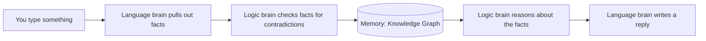
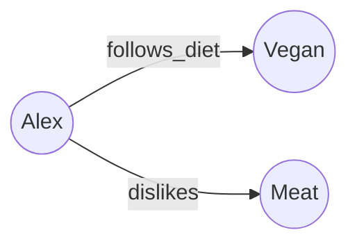
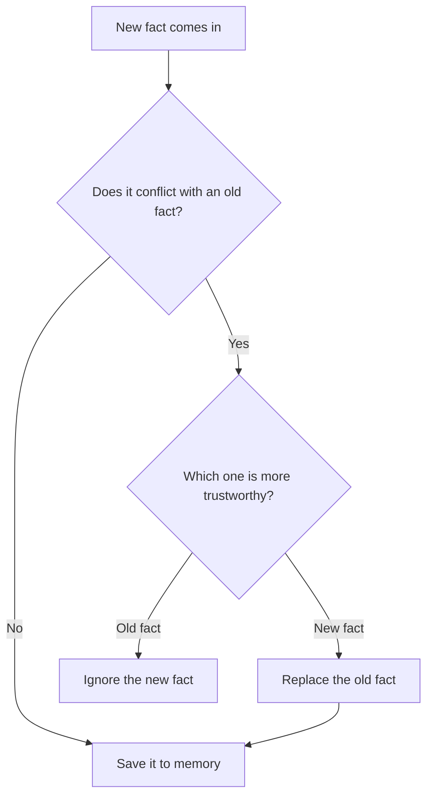
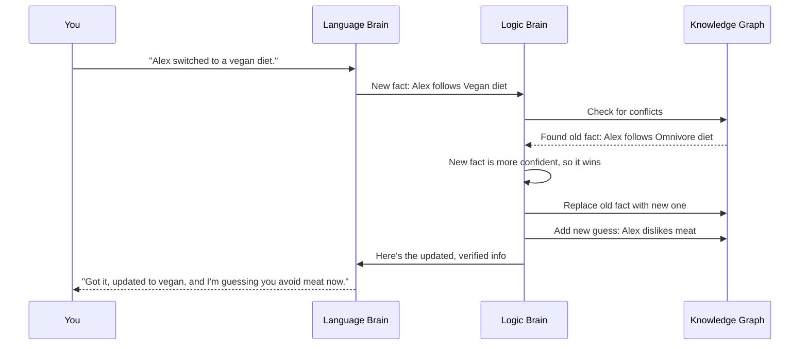
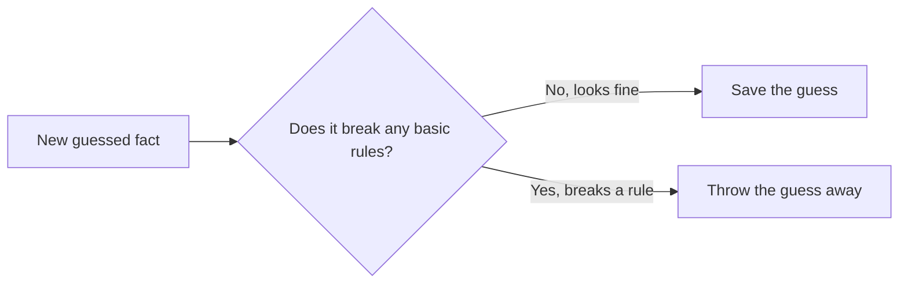

> **Note:** I used AI to help me organize and write this because I'm dyslexic. All the actual coding, the extraction logic, the graph setup, and the truth maintenance system, is mine, I wrote it myself. AI just helped me get my ideas into clean writing so it's easier to read. I already built a working early version of this, and this doc explains how it works and where I want to take it. I'm a student working on this in my free time, so it's not perfect and it's still growing. I'm open to feedback, ideas, or people pointing out mistakes, that's part of why I wrote this up in the first place.

# Neurosymbolic AI Engine

**Status:** 🧪 Working prototype, still growing

**The big idea:** combine an AI's language skills with old-school logical reasoning, so it can remember facts correctly, catch contradictions, and explain *why* it believes something, instead of just guessing the next word.

---

## 1. The Problem

Regular chatbots (LLMs) are just really good at predicting the next word. That makes them:
- **Forgetful:** they don't really "remember" facts between conversations
- **Wrong sometimes:** they can hallucinate made-up info
- **Bad at logic:** multi-step reasoning can break down
- **Stuck in time:** their knowledge is frozen from training

My fix: split the system into two parts that work together, one for **language**, one for **logic and memory**.

---

## 2. What I've Actually Built vs. What I Want to Build

**Built so far:**
- Pulls facts out of text and turns them into simple "subject → relationship → object" statements (called *triples*)
- Stores those facts in a graph (using Python's `NetworkX` library)
- Has a basic system that catches contradictions and decides which fact to trust
- Can update its beliefs without retraining the whole AI model

**Where I want to take it:**
- A full pipeline that keeps learning over time
- A "world model" that can simulate situations to double check if a fact makes sense
- Smarter combining of the language side and the logic side

---

## 3. How It Works (Big Picture)

Think of it like a brain with two halves:

- **Side A, Language brain:** reads input, pulls out facts, writes responses
- **Side B, Logic brain:** stores facts, checks them for contradictions, and reasons about them

---

## 4. Memory: The Knowledge Graph

Facts are stored like a web of connected dots. Each dot is a "thing" (like *Alex* or *Vegan*), and each line connecting two dots is a relationship (like *follows diet*).

Every fact also carries some extra info:
- **Confidence:** how sure the system is (0 to 1)
- **Source:** where the fact came from
- **Timestamp:** when it was added
- **Active or not:** is it still true, or was it replaced?

---

## 5. Catching Contradictions (Truth Maintenance)

This is the part that makes sure the memory doesn't get messy. Whenever a new fact comes in:

1. **Check:** does it clash with something already stored?
2. **Compare:** which one is more trustworthy?
3. **Update:** keep the stronger fact, drop the weaker one
4. **Ripple effect:** update anything else that depended on the old fact

---

## 6. Example: Watching It Think

Here's a walkthrough of what happens when you tell it something new that contradicts old info.

**You say:** "Alex switched to a vegan diet."

1. The language brain pulls out the fact: *(Alex, follows diet, Vegan)*
2. The logic brain checks memory and finds an old, conflicting fact: *(Alex, follows diet, Omnivore)*, saved with 85% confidence
3. The new fact has higher confidence (95%), so it wins
4. The old fact gets removed, along with anything that depended on it (like "Alex eats meat")
5. The new fact gets saved
6. The logic brain notices a pattern, vegans usually dislike meat, and adds a new fact: *(Alex, dislikes, Meat)*
7. It double-checks that this new guess actually makes sense (see Section 7)
8. **It replies:** "Updated Alex's profile to vegan. I'm guessing Alex avoids meat products now."

---

## 7. Sanity-Checking Guesses (World Model)

Before the system commits to a new *guessed* fact (like "Alex dislikes meat"), it runs a quick sanity check to make sure the guess doesn't break any basic rules about how the world works. If the guess passes, it gets saved. If not, it gets thrown out.

---

## 8. How This Compares to Normal AI

| Capability | Regular Chatbot | Old-School Logic System | My Engine |
| --- | --- | --- | --- |
| Talking naturally | Great | Terrible | Great (language brain) |
| Storing facts | Hidden inside the model | Fixed rulebook | Flexible graph that updates |
| Updating beliefs | Needs retraining | Manual edits | Automatic, in real time |
| Making stuff up | Happens a lot | Rare | Less common (facts are checked, but only as good as what it pulls out of the text) |
| Logical reasoning | Kind of fuzzy | Very precise | Precise, rule-based |
| Remembering things | Only within one chat | Just a static database | Persistent graph memory |

---

## 9. Why This Matters

A regular chatbot can sound confident while being wrong. This project tries to fix that by giving the AI an actual memory it can check itself against, instead of just trusting its own guesses. It's still early, but the core loop (extract a fact, check it against memory, catch contradictions, reason from it) already works.

---

**Questions or suggestions?** Email me at aakgaming2011@gmail.com
