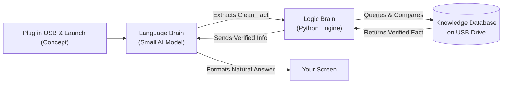
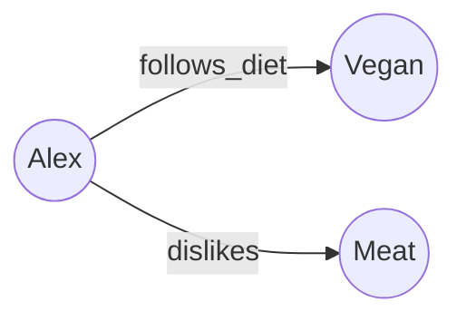
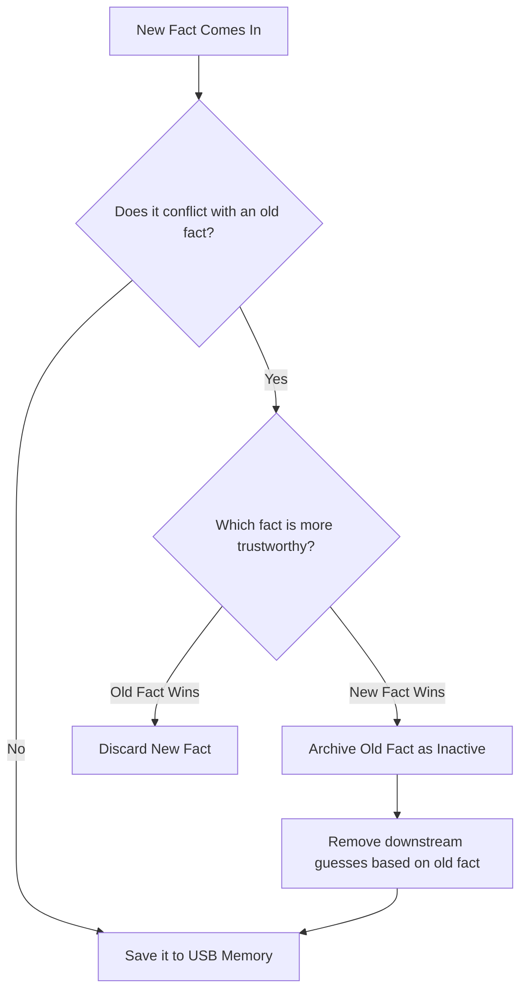
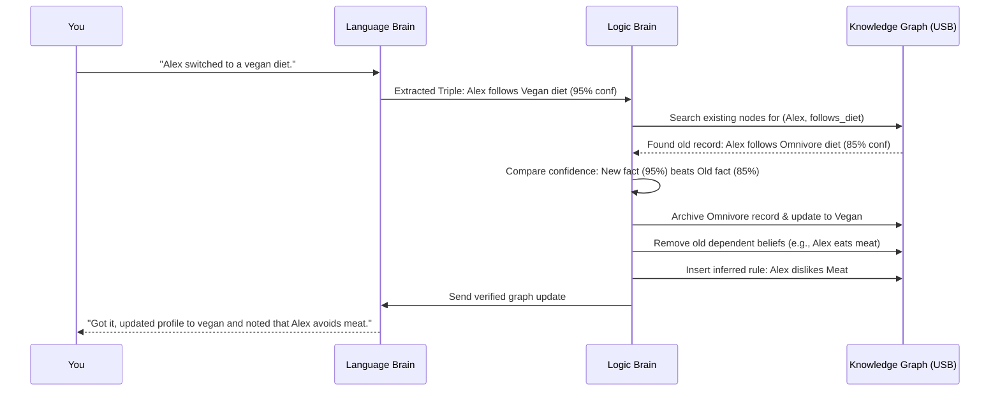
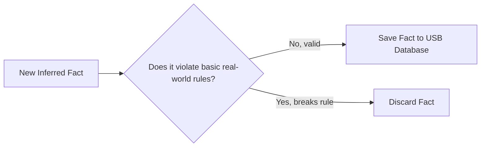

> **Note:** I used AI to help me organize and write this because I'm dyslexic. All the actual coding, extraction logic, graph setup, and truth maintenance concepts are my own work and research. AI helped me structure my ideas into clean, readable writing. Please note: **this document presents a theoretical framework, a conceptual architecture, and a personal project roadmap.** None of the features or specifications listed here are guaranteed promises this document explains how I believe this system *could* be built and what I want it to become as I continue developing it as a student in my free time. I welcome feedback, ideas, or corrections!

# Neurosymbolic AI Engine

**Status:** 🧪 Theoretical Architecture, Concept Roadmap & Early Prototype

**The big idea (in theory):** Combine an AI's natural language skills with old-school logical reasoning into a single, subscription-free tool. The goal is to design a system that could run completely offline off a USB thumb drive or SD card on everyday laptops, remembering facts correctly, catching contradictions, and keeping 100% of your data private.

---

## 1. Proposed Vision & Everyday Usage (What I Want It to Be)

* **One-Time Buy Concept:** The goal is a system you buy or build once and own forever zero monthly subscriptions, zero API fees, and no paywalled features.
* **100% Private & Local:** All conversations, extracted facts, and personal knowledge graphs would stay entirely on your physical storage device. No tracking, cloud telemetry, or data selling.
* **Plug-and-Play Portability Idea:** Designed so everything runs directly off a standard USB thumb drive or SD card. You could plug it into any PC or laptop, run the executable, and unplug when finished leaving zero files or trace on the host computer.
* **Targeting Lightweight Hardware:** The architectural goal is to run smoothly on standard consumer laptops (like an Intel Core i5 or AMD Ryzen 5 with 8 GB of RAM) without requiring an expensive dedicated graphics card (GPU).

---

## 2. The Theoretical Problem with Regular AI

Regular chatbots (LLMs) like GPT or Claude are trained on massive cloud servers. In theory and practice, that makes them:
- **Expensive:** They rely on recurring subscription models or cloud API costs.
- **Forgetful:** They don't actually "remember" facts between isolated conversations.
- **Unreliable:** They frequently hallucinate or invent false information with high confidence.
- **Resource-Heavy:** Running a raw model locally usually demands high-end gaming GPUs or workstation rigs.

**My proposed fix:** Split the system into two specialized parts that work together one for **language** and one for **logic and database memory**.

---

## 3. Conceptual System Design (The Brain Split)

In theory, the system works like two halves of a brain operating in tandem:

- **Language Brain (Small AI Model):** Reads your input, pulls out simple facts, and formats database records back into natural conversational answers.
- **Logic Brain (Python & Graph Database):** Stores facts, checks them for contradictions, enforces logic rules, and runs memory updates directly on your USB drive.

---

## 4. Current Progress vs. Theoretical Roadmap

**Built / Explored so far:**
- Basic fact extraction logic that pulls information out of raw text and converts it into simple "subject → relationship → object" statements (*triples*).
- Initial graph storage and local database persistence testing using Python (`NetworkX` and SQLite).
- Early logic for catching simple contradictions and comparing confidence ratings.

**Theoretical goals (What I want to build next):**
- A fully bundled runtime compiled into a single standalone executable file for Windows and Mac that runs directly off a USB or SD card.
- A lightweight local web interface that launches in your browser automatically when double-clicking the executable on the drive.
- A "world model" rule checker designed to simulate scenarios and verify if a new fact breaks basic commonsense rules before saving it.

---

## 5. Memory Model: The Knowledge Graph

Under this design, facts are stored in a web of connected concepts called a Knowledge Graph. Each item is a dot (like *Alex* or *Vegan*), and the line connecting them is the relationship (like *follows_diet*).

Every stored fact carries metadata:
- **Confidence Rating:** How sure the system is about the fact (from 0 to 1).
- **Source:** Where the information originated.
- **Timestamp:** When the fact was recorded.
- **Active Status:** Whether the fact is currently active or was archived/replaced by a newer update.

---

## 6. How Contradiction Checking Would Work (Truth Maintenance)

When you tell the system something new, the Logic Brain would execute a 4-step check against your USB database before modifying memory:

1. **Check:** Does the new statement clash with an old fact stored on the drive?
2. **Compare:** Is the new information more recent or higher confidence?
3. **Update:** Archive the old fact as inactive and save the new one.
4. **Ripple Effect:** Automatically remove or update downstream assumptions that relied on the replaced fact.

---

## 7. Step-by-Step Walkthrough: Theoretical Execution Example

Here is a theoretical walkthrough of what would happen inside the engine when processing contradictory information.

**Scenario Input:** *"Alex switched to a vegan diet."*

1. **Fact Extraction:** The Language Brain parses the input and extracts the triple: `(Alex, follows_diet, Vegan)` with a 95% confidence rating.
2. **Database Query:** The Logic Brain checks the USB Knowledge Graph and locates an old stored fact: `(Alex, follows_diet, Omnivore)` saved at 85% confidence.
3. **Conflict Resolution:** The new fact has higher confidence (95% vs 85%), so the system flags `Omnivore` as inactive.
4. **Cascade Clean-Up:** The system invalidates downstream assumptions linked to the old fact (e.g., removing `Alex eats steak`).
5. **Deductive Reasoning:** The Logic Brain evaluates its rulebook (`IF Vegan THEN dislikes Meat`) and generates a new inferred fact: `(Alex, dislikes, Meat)`.
6. **World Model Check:** The system verifies that this deduction doesn't violate basic world logic rules.
7. **Response Generation:** The Language Brain translates the verified graph update into plain language: *"Updated Alex's profile to vegan. I've updated my memory to reflect that Alex avoids meat."*

---

## 8. Sanity-Checking Guesses (Proposed World Model)

Before committing an *inferred* or *guessed* fact to the drive, the system would run a quick check against a basic set of world rules. If a guess breaks a rule, it gets discarded.

---

## 9. Theoretical Hardware Optimization Strategy

To achieve the goal of running offline on standard consumer laptops without expensive GPUs, the design relies on four technical strategies:

1. **4-Bit Model Quantization:** Using compressed `.gguf` models to fit a 3-billion parameter Small Language Model into ~2.5 GB of regular system RAM.
2. **CPU Execution via llama.cpp:** Leveraging CPU-based instruction sets (like AVX2) to run model math directly on standard Intel or AMD processors.
3. **Offloading Memory to Database Code:** Delegating memory to a fast SQLite/NetworkX graph on the drive, keeping the neural network small and preventing hallucinated memories.
4. **Portable Software Bundle:** Compiling the execution engine, scripts, and database into a self-contained folder that runs straight off a USB drive or SD card.

---

## 10. Theoretical Comparison

| Feature | Standard Cloud Chatbot | Pure Rule System | Proposed Neurosymbolic Engine |
| --- | --- | --- | --- |
| **Pricing Model** | Monthly subscriptions | Free / Open Source | Proposed one-time build |
| **Data Privacy** | Cloud hosted / Logged | Local | Designed for 100% offline USB/SD use |
| **Target Hardware** | Cloud GPU clusters | Low CPU usage | Standard laptop CPU & 8 GB RAM |
| **Natural Conversation** | Excellent | Poor / Command-line | Excellent (Language Brain) |
| **Memory Updates** | Requires model retraining | Manual database edits | Real-time automatic graph updates |
| **Fact Reliability** | Prone to hallucinations | Strict rules only | Grounded against local database |

---

## 11. Summary of Project Intent

This document lays out a vision for solving chatbot hallucinations, privacy concerns, and recurring subscription fees using a neurosymbolic approach. While it is still a conceptual project under active development, the goal is to show how combining small language models with logical graph databases could create a private, portable, and reliable AI system running on hardware people already own.

---

**Questions, suggestions, or feedback?** Email me at aakgaming2011@gmail.com
