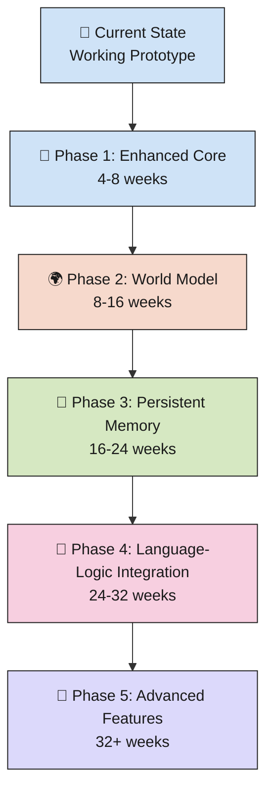
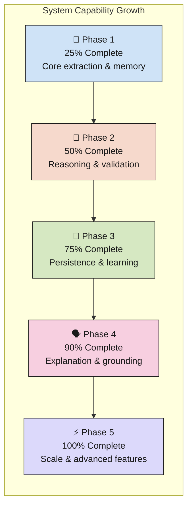
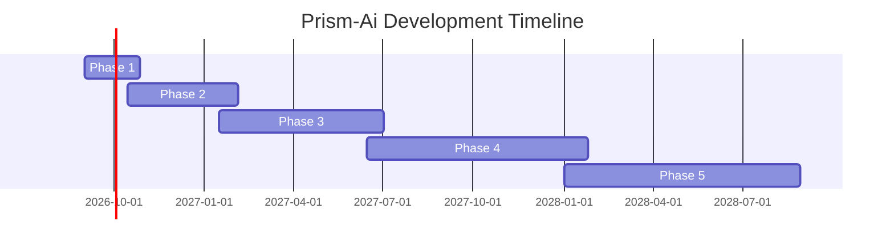

# Prism-Ai Development Roadmap

> **Note:** I used AI to help me organize and write this because I'm dyslexic. All the actual coding, the extraction logic, the graph setup, and the truth maintenance system, is mine, I wrote it myself. AI just helped me get my ideas into clean writing so it's easier to read. I already built a working early version of this, and this doc explains how it works and where I want to take it. I'm a student working on this in my free time, so it's not perfect and it's still growing. I'm open to feedback, ideas, or people pointing out mistakes, that's part of why I wrote this up in the first place.

**Last Updated:** September 2026
**Project Status:** 🧪 Working prototype, actively growing
**Vision:** Build a neurosymbolic AI engine that combines language understanding with logical reasoning and persistent memory.

---

## 📍 Current State (Completed)

- ✅ Fact extraction from natural language → triples (subject, relationship, object)
- ✅ Knowledge graph storage using NetworkX
- ✅ Basic contradiction detection and truth maintenance
- ✅ Confidence scoring system (0–1)
- ✅ Fact metadata (source, timestamp, active/inactive status)
- ✅ Real-time belief updates without retraining
- ✅ Core prototype working and documented

### Phase Dependencies

---

## 🚀 Phase 1: Enhanced Core (Next 4-8 weeks)

**Goal:** Strengthen the foundation and make the system more robust.

**Language & Extraction**
- [ ] Improve triple extraction accuracy (reduce missed facts)
- [ ] Handle complex sentence structures (conditionals, negations, multi-clause)
- [ ] Support relationship types beyond simple subject-verb-object
- [ ] Add entity linking (map "he" → "Alex", etc.)

**Knowledge Graph**
- [ ] Expand metadata tracking (source reliability, uncertainty types)
- [ ] Add temporal reasoning (time-dependent facts)
- [ ] Implement graph traversal for multi-hop reasoning
- [ ] Build query language for retrieving related facts

**Truth Maintenance**
- [ ] Improve confidence scoring logic
- [ ] Add multiple contradiction resolution strategies
- [ ] Track fact provenance chains (where did this belief come from?)
- [ ] Test edge cases and failure modes

**Deliverables:**
- Test suite with >50 test cases
- Updated documentation with examples
- Performance benchmarks (extraction speed, graph size limits)

---

## 🌍 Phase 2: World Model & Reasoning (8-16 weeks)

**Goal:** Build simulation and consistency checking for guessed facts.

**World Model Foundation**
- [ ] Define world rules/constraints (ontology)
- [ ] Implement rule-checking system for sanity checks
- [ ] Add constraint propagation
- [ ] Build cause-effect reasoning

**Inference Engine**
- [ ] Implement forward-chaining for deductions
- [ ] Add backward-chaining for fact validation
- [ ] Create assumption-based reasoning
- [ ] Support hypothetical scenarios ("what if...?")

**Guess Validation**
- [ ] Formalize sanity-check scoring
- [ ] Test guesses against world model before committing
- [ ] Probabilistic reasoning for uncertain scenarios
- [ ] Explain why a guess was accepted/rejected

**Deliverables:**
- Working world model with 20+ rules
- Validation system for guessed facts
- Example reasoning chains with explanations

---

## 🧠 Phase 3: Persistent Multi-Turn Memory (16-24 weeks)

**Goal:** Make memory persistent across conversations and sessions.

**Persistent Storage**
- [ ] Swap NetworkX for a persistent graph database (Neo4j or similar)
- [ ] Implement save/load for knowledge graphs
- [ ] Add versioning (track how beliefs changed over time)
- [ ] Support rollback to previous states

**Continuous Learning**
- [ ] Learn from each conversation without retraining
- [ ] Adapt confidence scores based on accuracy over time
- [ ] Identify and learn patterns from corrections
- [ ] Implement forgetting (decay confidence in unused facts)

**Memory Management**
- [ ] Implement efficient graph summarization
- [ ] Create memory search/retrieval optimization
- [ ] Add memory consolidation (merge redundant facts)
- [ ] Handle memory conflicts across sessions

**Deliverables:**
- Working persistent memory system
- Multi-session conversation examples
- Memory growth/decay analysis

---

## 🔗 Phase 4: Language-Logic Integration (24-32 weeks)

**Goal:** Tightly couple the language and logic "brains."

**Semantic Understanding**
- [ ] Map language embeddings to graph concepts
- [ ] Improve fact extraction using semantic similarity
- [ ] Generate natural language explanations from graph reasoning
- [ ] Handle ambiguity through graph context

**Response Generation**
- [ ] Ground responses in verified facts
- [ ] Explain reasoning steps in natural language
- [ ] Distinguish between known facts and guesses
- [ ] Cite sources for claims ("according to X...")

**Dialogue State**
- [ ] Track conversation context in the knowledge graph
- [ ] Build multi-turn dialogue memory
- [ ] Implement clarification questions
- [ ] Handle topic switching and coherence

**Deliverables:**
- Full dialogue examples with reasoning chains
- Explainability system
- Evaluation on BLEU/factual accuracy metrics

---

## 🎯 Phase 5: Advanced Features (32+ weeks)

**Goal:** Polish and extend the system with advanced capabilities.

**Meta-Learning**
- [ ] Learn world model rules from data
- [ ] Adapt reasoning strategy to domain
- [ ] Discover new relationship types automatically

**Multi-Agent Reasoning**
- [ ] Support multiple belief sources
- [ ] Implement consensus mechanisms
- [ ] Handle disagreements between sources

**Symbolic Knowledge Integration**
- [ ] Connect to external knowledge bases (Wikidata, DBpedia)
- [ ] Ground learned facts against reliable sources
- [ ] Federated knowledge graph queries

**Performance & Scale**
- [ ] Optimize for large graphs (100k+ facts)
- [ ] Distributed reasoning
- [ ] GPU-accelerated graph operations

**Deliverables:**
- Production-ready version
- Integration examples with knowledge bases
- Scaling benchmarks

---

## 📊 Success Metrics

Track progress by:
- **Accuracy:** % of extracted facts that are correct
- **Recall:** % of facts actually mentioned that get extracted
- **Consistency:** % of contradictions caught correctly
- **Reasoning:** % of multi-hop queries answered correctly
- **Speed:** Extraction/reasoning latency
- **Memory:** Graph size, query performance

### Capability Progression

---

## 🐛 Known Limitations & Tech Debt

Current issues to address:
- Fact extraction relies on prompt quality; needs more robust parsing
- Confidence scoring is heuristic-based; should be learned
- World model is manual; needs bootstrapping from data
- Scale: NetworkX graphs get slow above ~10k nodes
- Testing: Need a comprehensive test suite
- Documentation: Some internal logic needs clearer comments

---

## 🤝 How to Contribute

Working on this? Pick a phase and attack! Good starting points:
- **Easy:** Write tests, improve documentation, find bugs
- **Medium:** Implement Phase 1 features, optimize existing code
- **Hard:** Build Phase 2-5 features, design new systems

See contributing guidelines for code standards and submission process.

---

## 📅 Timeline Estimate

**Breakdown:**
- **Phase 1 (Enhanced Core):** September - October 2026 (4-8 weeks)
- **Phase 2 (World Model & Reasoning):** October 2026 - February 2027 (8-16 weeks)
- **Phase 3 (Persistent Memory):** January - July 2027 (16-24 weeks)
- **Phase 4 (Language-Logic Integration):** June 2027 - January 2028 (24-32 weeks)
- **Phase 5 (Advanced Features):** January 2028+ (32+ weeks, ongoing)

*Note: Estimates are flexible based on student workload and community contributions. Phases overlap slightly for smooth handoff.*

---

## 💭 Questions or Ideas?

Open an issue or reach out to: aakgaming2011@gmail.com

---

**Last Review:** September 18, 2026
**Next Review:** November 1, 2026
